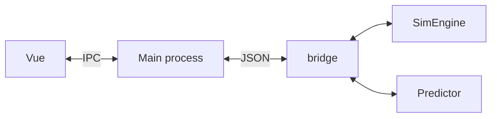
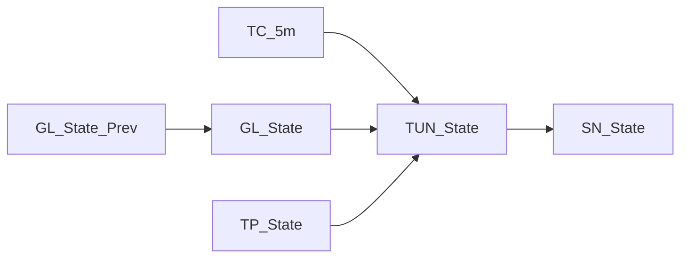

# Virtual Buddy

## Architecture

| Module              | Language                    |
| ------------------- | --------------------------- |
| **py-project/**     | Python                      |
| **visual-project/** | Electron + Vue 3 + Three.JS |

## Prerequisites

| Module             | Requirement      |
| ------------------ | ---------------- |
| **py-project**     | Python 3.12+     |
| **visual-project** | Node.js 18+, npm |

***

## Quick Start

### 1. Clone

```bash
git clone <url> virtual-buddy
cd virtual-buddy
```

### 2. Train the model (one-time)

```bash
cd py-project/
pip install -r requirements.txt
python meal_model/train.py # creates meal_model/model.pkl
```

### 3. Start the 3D pet (Python auto-starts)

```bash
cd visual-project/
npm install
npm run dev
```

**4.Optional: Offline CLI test (no Electron needed)**

```bash
cd py-project/
python run_simulation.py    
```

***

## Development Status

**Py-project**

- [x] Bayesian training

* [x] MealPredictor

- [x] Running engine

* [x] JSON IPC

Visual-project

- [x] python-bridge

* [x] &#x20; IPC handler

- [ ] Event Center （bug）

* [ ] 3D and Animation optimization 

- [ ] Chart visulization

* [ ] Historical data importer
* [ ] Higher level interection

***

## Protocal

### IPC Channels

| Channel               | Direction                | Description                            |
| --------------------- | ------------------------ | -------------------------------------- |
| `simulate-step`       | renderer → main (invoke) | Advance 1 step, returns SimState JSON  |
| `simulate-state`      | renderer → main (invoke) | Get current SimState without stepping  |
| `simulate-reset`      | renderer → main (invoke) | Reset simulation to t=0                |
| `simulate-config`     | renderer → main (invoke) | Update thresholds, returns `{ok:true}` |
| `simulate-auto-start` | renderer → main (invoke) | Start periodic stepping (param: speed) |
| `simulate-auto-stop`  | renderer → main (invoke) | Stop periodic stepping                 |
| `sim-state-update`    | main → renderer (send)   | Pushed each auto-step interval         |

***

## How It Works

The simulation runs in three layers:

### Data Flow



<br />

Trained on open source patient data\[^1] with  `DiscreteBayesianNetwork`:



| Node        | Meaning                  | Bins                        |
| ----------- | ------------------------ | --------------------------- |
| `TC_5m`     | Time of day (5-min bins) | 0–287                       |
| `GL_State`  | Current glucose          | < 70 / 70–140 / 140+ mg/dL  |
| `TP_State`  | Time since last meal     | < 30m / 30m–2h / 2–4h / 4h+ |
| `TUN_State` | Time until next meal     | < 1h / 1–3h / 3h+           |
| `SN_State`  | Next meal size           | snack / normal              |

### 3. Alert

Simple threshold

| Alert          | Trigger                                        |
| -------------- | ---------------------------------------------- |
| `low_glucose`  | glucose < 70 for 2 consecutive steps (10 min)  |
| `high_glucose` | glucose > 180 for 3 consecutive steps (15 min) |

***

## Tech Stack

| Layer        | Technology                                     |
| ------------ | ---------------------------------------------- |
| Simulation   | `simglucose`  `pgmpy`                          |
| Desktop app  | `Electron`, `Vue 3`, `TypeScript`              |
| 3D rendering | `TresJS` (Three.js for Vue), `@tresjs/cientos` |
| Styling      | `Tailwind CSS`                                 |
| Storage      | `Dexie.js` (IndexedDB)                         |

***

<br />

\[^1]Data source: HUPA-UCM Diabetes Dataset - Mendeley Data
